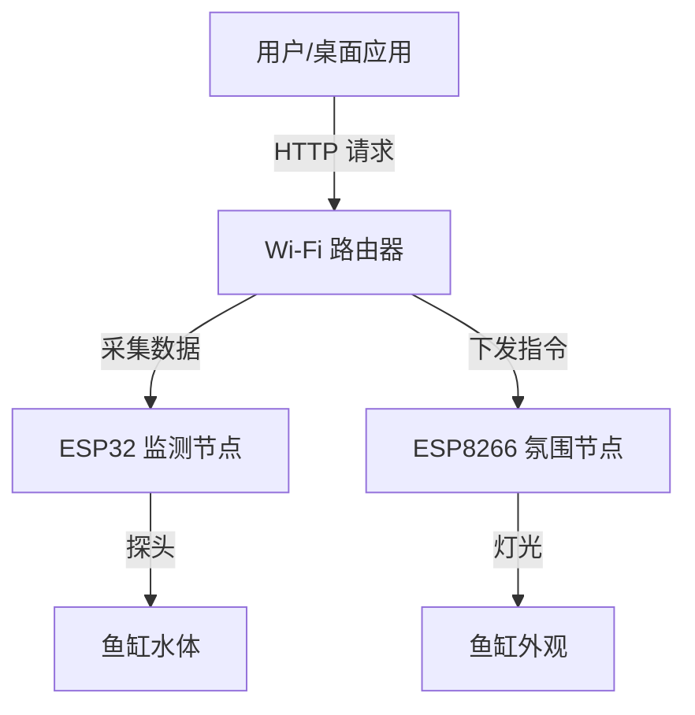

```
# 📘 AquaGuard 韩家家庭智能系统 - 技术规格说明书

| 项目 | 内容 |
| :--- | :--- |
| **项目名称** | AquaGuard Intelligent Ecosystem |
| **版本号** | v1.0.0 Alpha |
| **最后更新** | 2026-01-25 |
| **核心架构** | ESP32 (感知) + ESP8266 (氛围) + Python (桌面视窗) |
| **开发目标** | 打造高颜值、模块化、可视化的桌面级智能养鱼系统 |

---

## 1. 系统总体架构 (System Architecture)

本系统采用 **分布式物联网 (Distributed IoT)** 架构。为了降低单点故障风险并最大化利用芯片特性，我们将系统拆分为“感知”与“执行”两个独立节点，通过 Wi-Fi 局域网由 PC 桌面端统一调度。



------

## 2. 硬件层详细设计 (Hardware Layer)

### 2.1 节点 A：环境感知中心 (Sensor Node)

负责全天候监测鱼缸物理参数，数据异常时提供基础判断依据。

- **主控核心**: ESP32-WROOM-32E (4MB Flash)
- **供电方式**: 5V Type-C 独立供电
- **传感器清单**:

| **传感器名称** | **型号规格**             | **接口 (GPIO)** | **采集频率** | **备注**           |
| -------------- | ------------------------ | --------------- | ------------ | ------------------ |
| **水温传感器** | **DS18B20** (不锈钢防水) | GPIO 25         | 2秒/次       | 需接 4.7k 上拉电阻 |
| **水质检测**   | **Gravity 模拟 TDS**     | GPIO 34 (ADC1)  | 5秒/次       | 需软件滤波去噪     |
| **水位监测**   | **XKC-Y25-V** (非接触式) | GPIO 26         | 实时 (中断)  | 贴于缸壁外侧       |

### 2.2 节点 B：氛围控制中心 (Atmosphere Node)

负责鱼缸的灯光渲染，支持无级调色与呼吸特效。

- **主控核心**: ESP8266 (NodeMCU v3)
- **供电方式**: 5V Micro-USB (需确保电流 > 2A)
- **执行器清单**:

| **执行器名称** | **型号规格**           | **接口**    | **驱动库**        | **备注**           |
| -------------- | ---------------------- | ----------- | ----------------- | ------------------ |
| **智能灯带**   | **WS2812B** (RGB 全彩) | D2 (GPIO 4) | Adafruit_NeoPixel | 需接 3.3V 逻辑电平 |

------

## 3. 固件 API 接口定义 (Firmware API)

为了实现桌面软件与硬件的解耦，所有通信均基于 **HTTP RESTful API**。

### 3.1 ESP32 数据接口

**功能**: 获取当前所有传感器数据。

- **URL**: `GET http://[ESP32_IP]/status`

- **响应示例 (JSON)**:

  JSON

  ```
  {
    "system": {
      "uptime": 12050,         // 运行时间(秒)
      "wifi_signal": -45       // 信号强度
    },
    "sensors": {
      "temperature": 26.5,     // 单位：摄氏度
      "tds_value": 142,        // 单位：ppm
      "water_level": 1,        // 1: 正常, 0: 缺水
      "alert_flag": false      // 硬件级报警标志
    }
  }
  ```

### 3.2 ESP8266 控制接口

**功能 1**: 开关控制

- **URL**: `GET http://[ESP8266_IP]/power?state=[on/off]`

**功能 2**: 颜色设定

- **URL**: `GET http://[ESP8266_IP]/color?r=255&g=0&b=128`
- **参数**: 0-255 之间的整数。

**功能 3**: 模式切换

- **URL**: `GET http://[ESP8266_IP]/mode?type=[rainbow/breath/static]`

------

## 4. 桌面端应用设计 (Desktop Application)

上位机是本系统的核心，采用 **Python** 开发，追求极简与科技感并存的视觉体验。

### 4.1 技术栈 (Tech Stack)

- **编程语言**: Python 3.10+
- **UI 框架**: `CustomTkinter` (基于 Tkinter 的现代化、扁平化、支持圆角和深色模式的库)
- **网络库**: `Requests` (处理 HTTP 通信)
- **图表库**: `Matplotlib` (绘制温度历史曲线)

### 4.2 界面功能规划 (UI/UX)

#### 🎨 视觉风格 (Visual Identity)

- **主题**: Cyberpunk Dark (赛博朋克暗色)
- **主色调**: 深灰 (#2B2B2B) + 霓虹蓝 (#00E5FF) + 警示红 (#FF2E63)
- **字体**: 微软雅黑 / Roboto (无衬线字体)

#### 🖥️ 功能模块详解

**A. 仪表盘 (Dashboard)**

1. **动态水温球**: 模拟水波纹效果，显示当前温度。若 >30°C，波纹变红并闪烁。
2. **TDS 纯净度条**: 进度条显示水质，分为“优/良/差”三段颜色。
3. **水位状态灯**: 正常显示蓝色水滴图标，缺水显示红色划线水滴。

**B. 灯光指挥台 (Lighting Console)**

1. **RGB 拾色器**: 圆形色盘，鼠标点击任意位置，鱼缸灯光实时同步。
2. **情景模式卡片**:
   - 🌞 **日光模式**: 模拟正午阳光 (纯白高亮)。
   - 🌙 **月光模式**: 模拟夜间微光 (深蓝低亮)。
   - 🌈 **极光模式**: 缓慢的 RGB 渐变呼吸效果。

**C. 自动化中心 (Automation Hub)**

- **温度报警**: 用户设定阈值 (如 28°C)，触发时电脑播放提示音 + 弹窗。
- **定时开关**: 设定 "08:00 开灯" 和 "22:00 关灯"。

------

## 5. 配置与存储 (Configuration)

软件将生成 `config.json` 文件，用于持久化保存用户设置，避免每次打开都要重新输入 IP。

JSON

```
{
  "devices": {
    "sensor_node_ip": "192.168.1.5",
    "light_node_ip": "192.168.1.6"
  },
  "settings": {
    "refresh_interval_ms": 3000,
    "max_temp_alert": 30.0,
    "min_temp_alert": 20.0
  },
  "schedule": {
    "enable": true,
    "on_time": "09:00",
    "off_time": "23:00"
  }
}
```

------

## 6. 开发路线图 (Development Roadmap)

### 🟢 阶段一：硬件基建 (Hardware & Firmware)

- [x] 搭建 Arduino 开发环境。
- [ ] **ESP8266**: 刷入 WebServer 固件，实现 /on, /off, /color 接口。
- [ ] **ESP32**: 连接 DS18B20 与 TDS，实现 /status JSON 数据输出。
- [ ] **测试**: 使用浏览器访问 IP，确保能看到数据和控制灯。

### 🟡 阶段二：软件原型 (Software Prototype)

- [ ] 配置 Python 环境，安装 `customtkinter`。
- [ ] 编写 GUI 骨架，实现 IP 输入框和基础按钮。
- [ ] 联调：Python 点击按钮 -> ESP8266 灯亮。

### 🔴 阶段三：完全体 (Final Polish)

- [ ] 美化 UI：加入图标、圆角卡片、深色主题。
- [ ] 加入后台线程：每 3 秒自动拉取 ESP32 数据并刷新界面。
- [ ] 增加报警逻辑和定时功能。
- [ ] 打包为 `.exe` 可执行文件。

------

> **💡 开发者注**:
>
> 本文档旨在指导 AquaGuard 系统的全流程开发。在硬件连接时，请务必注意防水处理；在软件开发时，建议优先使用模块化编程，便于后期维护。